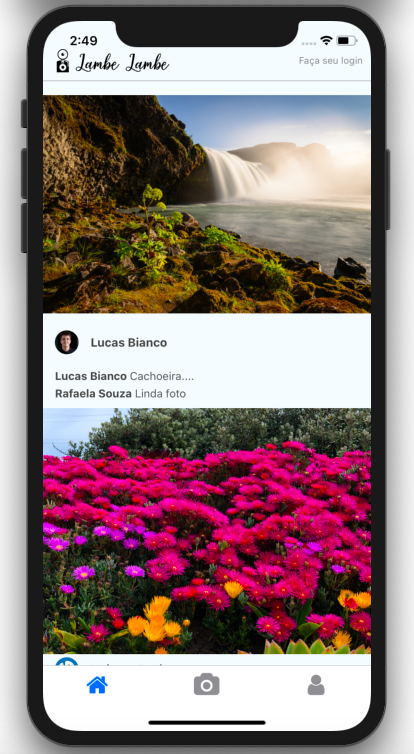

# Lambe-Lambe

## This is a shorten copy of the Instagram.

Developed with the react-native course from cod3r.

### Axios

- 0.19.0

Used to create HTTP requisitions to the backend, using local routes defined to the Firebase.

### React-native-image-picker

- 2.3.1

Used to take the photos to post on the feed.

### React-navigation

- React-navigation-stack 2.7.0
- React-navigation-tabs 2.8.13

### Redux

- React-redux 7.2.0
- redux 4.0.5
- redux-thunk 2.3.0

Used to manage feed state, when adding photos and at users logins.

### Firebase

Used to store users data and for email authentication.
